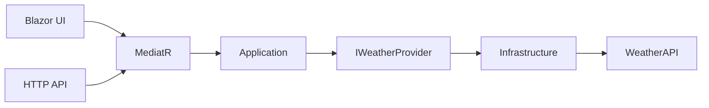

# Weather App

Production-grade weather dashboard for Moscow built with .NET 10, Blazor Interactive Server, MediatR, and Clean Architecture.

## Demo / Overview

Screenshots will be added after the Blazor UI sprint.

## Features

- Current weather for Moscow.
- Remaining hourly forecast for today and complete hourly forecast for tomorrow.
- Three-day daily forecast.
- Loading, error, and retry states.
- WeatherAPI hidden behind an Infrastructure adapter.
- Resilience, cache, observability, Docker, CI, and tests planned by sprint.

## Architecture

## Technology Stack

- .NET 10
- ASP.NET Core / Blazor Interactive Server
- MediatR
- xUnit
- bUnit
- WireMock.Net
- Playwright
- BenchmarkDotNet / NBomber

## Getting Started

Content will be completed when the runnable web application exists.

## Configuration

The WeatherAPI key is supplied from outside the repository. It is not committed and must not appear in source, fixtures, logs, screenshots, Docker layers, or CI output.

## Running Locally

To be completed after the web project is implemented.

## Running With Docker

To be completed in the Docker sprint.

## Testing

To be completed as test layers are added.

## Resilience

The planned provider pipeline includes timeout, bounded retry, circuit breaker, `HybridCache`, stampede protection, and stale fallback.

## Observability

The planned observability surface includes structured logs, health checks, trace correlation, and OpenTelemetry-ready metrics/traces.

## Security

Credentials are externalized. Provider URLs with query strings are never logged.

## Architecture Decisions

- [ADR-001: Clean Architecture And MediatR](docs/decisions/ADR-001-clean-architecture.md)
- [ADR-002: WeatherAPI Provider Contract](docs/decisions/ADR-002-weather-provider.md)
- [ADR-003: Blazor Interactive Server Rendering](docs/decisions/ADR-003-server-rendering.md)
- [ADR-004: Error Handling Model](docs/decisions/ADR-004-error-handling.md)
- [ADR-005: Caching And Resilience](docs/decisions/ADR-005-caching-resilience.md)

## Trade-offs

- No SQL database: weather state is external and transient, and the requirements contain no persistence use case.
- No message broker: there is no asynchronous business workflow.
- No distributed cache by default: one fixed city and one instance do not justify mandatory Redis infrastructure.
- No microservices: the domain and deployment scale do not warrant service decomposition.
- No authorization: the application is public and read-only.
- No FluentValidation initially: the weather query has no user-supplied parameters.

## Possible Next Steps

- Multiple cities.
- Multiple providers with failover.
- Distributed cache for horizontal scaling.
- Optional background cache refresh.
- External OTLP backend.
- Container orchestration.
