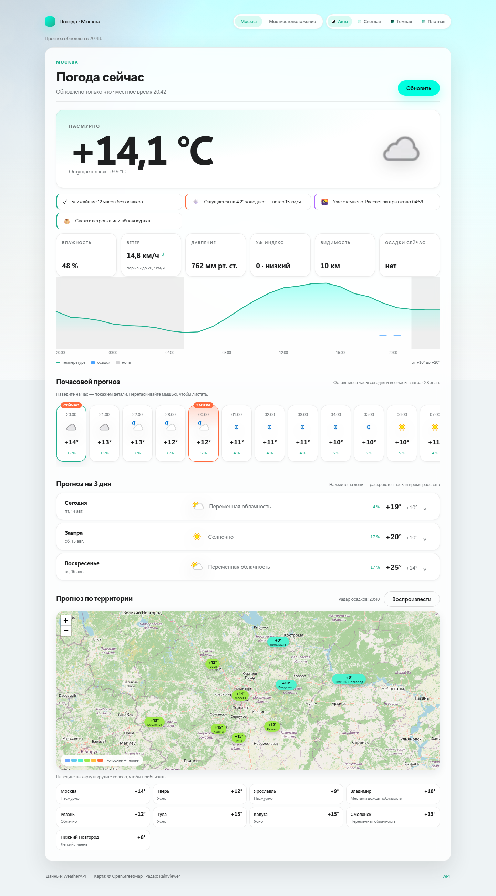
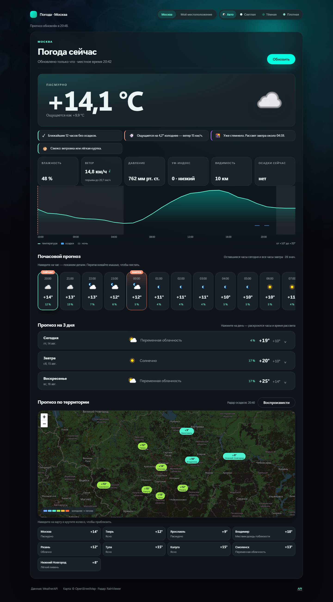
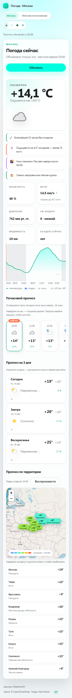
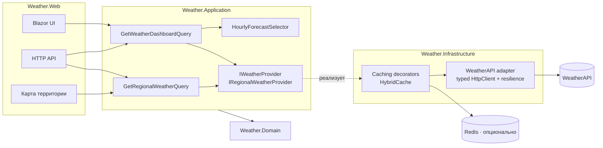

# Weather App — Москва

Погодное веб-приложение на **.NET 10**, **Blazor Interactive Server**, **MediatR** и **Clean
Architecture**. Один экран: текущая погода, оставшиеся часы сегодня и все часы завтра, прогноз на три
дня, и карта осадков по территории.



<p align="center">
  
  
</p>

---

## Что внутри

| | |
|---|---|
| **Экран** | Текущая погода, подсказки-выводы, график на 48 часов, почасовой прогноз (остаток сегодня + все 24 часа завтра), раскрываемый прогноз на 3 дня, карта территории |
| **Состояния** | Скелетон загрузки, человекопонятная ошибка, кнопка повтора, плашка устаревших данных |
| **Живость** | Автообновление, живое «обновлено N назад», опциональная геолокация, лента с наведением и перетаскиванием, PWA с офлайн-режимом |
| **Оформление** | Четыре темы (авто / светлая / тёмная / плотная), 3D-фон на WebGL, реагирующий на реальную погоду, вступительный экран |
| **Бэкенд** | MediatR-use case, typed `HttpClient`, resilience-пайплайн, `HybridCache` + Redis, HTTP API с OpenAPI |
| **Качество** | 153 теста: unit, architecture, component, contract, integration, E2E, benchmark |
| **Эксплуатация** | Health checks, OpenTelemetry, structured logging, Docker с hardening, GitHub Actions |

## Быстрый старт

```powershell
dotnet user-secrets set "WeatherApi:Credential" "<ваш WeatherAPI credential>" --project src/Weather.Web
dotnet run --project src/Weather.Web
```

Через Docker:

```powershell
Copy-Item .env.example .env      # затем впишите WEATHERAPI_CREDENTIAL
docker compose up --build -d
```

Приложение поднимется на `http://localhost:8080`, документация API — на `/docs`.

Всё, что проверяет CI, запускается одной командой:

```powershell
./scripts/verify.ps1            # ./scripts/verify.sh на Linux/macOS
```

Маршрут для ревьюера на 10 минут — [docs/REVIEW.md](docs/REVIEW.md).

## Архитектура



Зависимости идут строго внутрь: `Domain ← Application ← Infrastructure ← Web`. `Application` не знает
ни про HTTP, ни про Razor, ни про WeatherAPI — только про свои контракты провайдеров. Правила проверяются
не глазами, а [двенадцатью architecture-тестами](tests/Weather.Architecture.Tests): направления
зависимостей, отсутствие `HttpClient` вне Infrastructure, непубличность DTO провайдера, запрет системных
часов в бизнес-логике и отсутствие credential в конфигурационных файлах.

Подробнее — [docs/architecture.md](docs/architecture.md).

## Ключевые инженерные решения

**Почасовое окно.** Ядро задания — выбрать «оставшиеся часы сегодня и все часы завтра». Это чистая
детерминированная функция `HourlyForecastSelector`, у которой нет доступа к системным часам: «сейчас»
приходит из `location.localtime` ответа провайдера. Сервер в UTC, контейнер в UTC, CI в третьей зоне —
результат от этого не зависит. Инвариант `count == (24 - hour) + 24` проверен на всех 24 часах.

**Prerender выключен осознанно.** Blazor Interactive Server по умолчанию выполняет `OnInitializedAsync`
дважды — при статическом рендере и при подключении circuit. Это два обращения к платному API на каждое
открытие страницы. Prerender отключён, а component-тест фиксирует: одно открытие = один запрос.

**`days=3` и оба эндпоинта.** WeatherAPI считает сегодня первым днём, поэтому `days=3` покрывает и
«завтра», и «три дня». `forecast.json` уже содержит секцию `current`, то есть второй вызов технически не
нужен — но он назван в ТЗ, поэтому вызывается параллельно через `Task.WhenAll` и отключается флагом
`WeatherApi:UseSeparateCurrentEndpoint`. Запрос идёт по `q=LAT,LON`, как в задании.

**Контракт провайдера прочитан, а не угадан.** `pressure_mb`, `humidity` и `chance_of_rain` приходят
дробными (`1013.0`), хотя выглядят целыми. Привязка их к `Int32` проходит на любых рукописных фикстурах
и падает на живом API. Поймано вызовом настоящего провайдера, зафиксировано contract-тестом на
live-shaped фикстуре.

**Локация: Москва по умолчанию, своя — по кнопке.** ТЗ фиксирует Москву, поэтому она остаётся значением
по умолчанию, а координаты посетителя подставляются только после явного нажатия — браузерный запрос
разрешения сам по себе не всплывает. Ключ кэша включает координаты, так что данные одной точки никогда не
отдаются другой. `Permissions-Policy` разрешает геолокацию только этому origin.

**Почасовая лента — клиентское взаимодействие.** Наведение показывает детали часа, перетаскивание мышью
листает ленту, вертикальное колесо прокручивает её горизонтально. Всё это сделано в JS-модуле, а не через
`@@onmouseover` в Blazor: на Blazor Server каждое событие DOM — это round-trip по circuit, и курсор,
проезжающий по 33 карточкам, дал бы очередь из них.

**Ответы вместо показателей.** `WeatherAdvisor` — чистая функция над уже полученными данными: когда
начнётся дождь, почему ощущается холоднее, когда высокий УФ, как одеться, сколько осталось светлого
времени. Никаких дополнительных вызовов провайдера, 20 тестов на правила.

**Данные, за которые уже заплачено.** В ответе `forecast.json` лежит около 25 полей на час, из которых
приложение раньше использовало пять. Теперь оттуда же берутся осадки в мм, ощущаемая температура по часам,
направление ветра, УФ по часам, день/ночь и блок `astro` — график, подсказки и раскрытие дня не стоят ни
одного лишнего запроса.

**Офлайн — честный.** Blazor Server требует живого circuit, поэтому интерактивная страница офлайн работать
не может, и притворяться иначе нечестно. Service worker хранит последний успешный ответ `/api/weather` и
отдаёт отдельную статическую страницу, которая его рисует. Это работающий офлайн, а не оболочка, которая
загрузилась и ничего не умеет.

**Ошибки — закрытая таксономия.** Ни UI, ни API не видят исключений транспорта: `Timeout`, `Provider`,
`Auth`, `RateLimit`, `Protocol`, `Configuration`, `Unknown`. UI переключается по `WeatherFailureKind`,
API отдаёт `ProblemDetails` с `traceId`. Неизвестное исключение не роняет Blazor circuit — страница
показывает состояние с кнопкой повтора.

## Конфигурация

| Ключ | По умолчанию | Назначение |
|---|---|---|
| `Weather:Location` | `Москва` | Отображаемое имя. Пользователь город не меняет |
| `Weather:Latitude` / `Longitude` | `55.7522` / `37.6156` | Значение `q=LAT,LON` для провайдера |
| `Weather:ForecastDays` | `3` | WeatherAPI считает сегодня первым днём |
| `Weather:TimeZoneId` | `Europe/Moscow` | Только fallback, если провайдер не прислал локальное время |
| `Weather:Cache:*` | 5 / 10 / 15 мин, stale 1 ч | Времена жизни кэша |
| `Weather:AutoRefresh:Enabled` / `Interval` | `true` / 1 мин | Автообновление открытой страницы (читает кэш, не провайдера) |
| `Weather:Region:Enabled` | `true` | Карта территории; каждый пункт — один вызов провайдера |
| `Weather:BackgroundRefresh:Enabled` | `false` | Фоновое обновление кэша |
| `WeatherApi:BaseUrl` | `https://api.weatherapi.com` | Только HTTPS (исключение — loopback для тестов) |
| `WeatherApi:RequestTimeout` / `TotalTimeout` | 5 с / 15 с | Бюджет попытки и всего вызова |
| `WeatherApi:MaxRetryAttempts` | `2` | Повторы только для 5xx/408/сетевых |
| `WeatherApi:CircuitBreaker:*` | 0.5 / 5 / 15 с / 30 с | Пороги размыкателя |
| `Api:RateLimit:*` | 30 запросов в минуту | Лимит публичного HTTP API |
| `ConnectionStrings:Redis` | — | Включает распределённый backend для `HybridCache` |
| `Security:DataProtectionKeyPath` | — | Путь для ключей DataProtection (нужен для read-only ФС) |
| **WeatherAPI credential** | — | **Только извне: user-secrets, переменная окружения, CI secret** |

Credential в репозитории нет и не было. Проверено architecture-тестом.

## HTTP API

| Метод | Маршрут | Описание |
|---|---|---|
| `GET` | `/api/weather` | Дашборд: текущая, почасовая, дневная |
| `GET` | `/api/weather/region` | Точки карты территории |
| `GET` | `/health/live` | Процесс жив |
| `GET` | `/health/ready` | Конфигурация валидна (провайдер не вызывается) |
| `GET` | `/openapi/v1.json`, `/docs` | OpenAPI-документ и Scalar UI |

UI и API используют **один и тот же** MediatR use case — второй реализации бизнес-логики нет, и это
проверено E2E-тестом, который сверяет числа на экране с ответом API.

## Тесты

```powershell
dotnet test WeatherApp.slnx
```

| Уровень | Проект | Тестов | Что доказывает |
|---|---|---:|---|
| Unit | `Weather.Application.Tests` | 58 | Почасовое окно на всех 24 часах, границы суток, частичные и пустые ответы, отмена, use case карты |
| Architecture | `Weather.Architecture.Tests` | 12 | Направления зависимостей, границы, отсутствие системных часов, отсутствие credential в конфигах |
| Component | `Weather.ComponentTests` | 25 | Состояния экрана, повтор без дублей запроса, доступность, устойчивость к неполным данным |
| Contract | `Weather.Infrastructure.Tests` | 28 | Реальный `HttpClient` против WireMock: маппинг, форма запроса, 401/429/5xx/malformed/timeout, retry-политика, отсутствие credential в логах |
| Integration | `Weather.IntegrationTests` | 16 | Настоящий хост: DI-граф, ProblemDetails, кэш, стампид на 50 запросах, rate limit, security-заголовки, stale-fallback |
| E2E | `Weather.E2ETests` | 11 | Chromium против настоящего Kestrel: загрузка, ошибка и восстановление, мобильная вёрстка, клавиатура, темы, CSP |
| Performance | `Weather.PerformanceTests` | 3 | BenchmarkDotNet-цели: десериализация, маппинг, выбор окна |

Ни один тест не зависит от системного времени, таймзоны машины или сети.

Отдельно стоит один тест: `Handler_tolerates_a_snapshot_missing_fields_added_by_a_later_version`.
Распределённый кэш переживает деплой, и запись, сделанная до появления поля, десериализуется с ним
по умолчанию. Именно эта форма уронила живой инстанс после добавления блока `astro` — теперь ключ кэша
версионируется на каждое изменение схемы, а маппинг деградирует вместо падения.

Playwright требует браузера — если он не установлен, E2E-набор помечается как пропущенный, а не падает:

```powershell
pwsh tests/Weather.E2ETests/bin/Debug/net10.0/playwright.ps1 install chromium
```

Подробнее — [docs/testing.md](docs/testing.md).

## Устойчивость

- Таймауты живут в resilience-пайплайне, а не в `HttpClient.Timeout` — иначе жёсткий таймаут клиента
  срабатывает поверх всей последовательности повторов и приходит сырым `TaskCanceledException`.
- Повторы только для 5xx, 408 и сетевых сбоев. 401/403 от повтора не станут валиднее, 429 от повтора
  станет хуже.
- Circuit breaker с настраиваемыми порогами.
- `HybridCache` даёт stampede protection из коробки: 50 одновременных читателей на холодном кэше дают
  один вызов провайдера (проверено integration-тестом).
- Stale-fallback: если провайдер лёг, а последний удачный снимок ещё жив, экран показывает его с плашкой,
  а не ошибку.

## Наблюдаемость

Structured logging без интерполяции строк, события `weather_request_started/completed/failed`,
`weather_provider_call`, `weather_stale_served`, `weather_refresh_*`. OpenTelemetry: трейсы ASP.NET Core и
`HttpClient`, метрики `weather.query.duration`, `weather.provider.duration`, `weather.provider.failures`,
`weather.cache.hits/misses`, `weather.cache.stale_served`, `weather.refresh.executions`. Экспортёр не
привязан к вендору: OTLP включается наличием `OTEL_EXPORTER_OTLP_ENDPOINT`.

Подробнее — [docs/observability.md](docs/observability.md).

## Безопасность

Credential только извне, никогда в логах (проверено тестом). HTTPS до провайдера. CSP без `unsafe-inline`
и `unsafe-eval` для скриптов — поэтому Leaflet вендорится локально, а не тянется с CDN. Контейнер: non-root,
`cap_drop: ALL`, `no-new-privileges`, read-only корневая ФС. Ошибки не раскрывают внутренностей. CI падает
на любом уязвимом пакете, включая транзитивные.

Подробнее — [ADR-007](docs/decisions/ADR-007-security-posture.md).

## Архитектурные решения

- [ADR-001 — Clean Architecture и MediatR](docs/decisions/ADR-001-clean-architecture.md)
- [ADR-002 — Контракт провайдера WeatherAPI](docs/decisions/ADR-002-weather-provider.md)
- [ADR-003 — Blazor Interactive Server и prerender](docs/decisions/ADR-003-server-rendering.md)
- [ADR-004 — Модель ошибок](docs/decisions/ADR-004-error-handling.md)
- [ADR-005 — Кэширование и устойчивость](docs/decisions/ADR-005-caching-resilience.md)
- [ADR-006 — Карта территории](docs/decisions/ADR-006-territory-map.md)
- [ADR-007 — Модель безопасности](docs/decisions/ADR-007-security-posture.md)

## Что осознанно НЕ добавлено

- **Нет базы данных.** У погоды нет состояния, которое имеет смысл хранить: данные внешние и
  короткоживущие. Persistence здесь не решает ни одной задачи из ТЗ.
- **Нет брокера сообщений.** Нет ни одного асинхронного бизнес-процесса, который стоило бы разнести
  во времени.
- **Redis опционален.** В Compose он есть как distributed backend для `HybridCache`, но локально
  приложение работает без обязательной инфраструктуры.
- **Нет микросервисов.** Ни домен, ни нагрузка не дают повода декомпозировать одно приложение.
- **Нет авторизации.** Приложение публичное и read-only — аутентифицировать нечего.
- **Нет FluentValidation.** У запроса нет пользовательских параметров: валидировать нечего.
- **Нет Hangfire/Quartz.** Единственная периодическая задача — прогрев кэша, и её закрывает
  `BackgroundService` из платформы.

SQL Server, очереди и планировщики есть в описании вакансии, но в этой задаче у них нет естественного
применения. Показывать их здесь означало бы выбирать технологию по чек-листу, а не по задаче.

## Как это масштабировалось бы

Несколько городов — параметр use case вместо конфигурации, ключ кэша уже версионирован. Несколько
провайдеров — второй адаптер за тем же `IWeatherProvider` и failover-декоратор. Горизонтальное
масштабирование — Redis уже подключён, состояние в приложении отсутствует. Рост числа точек карты —
перенос свипа в `BackgroundService`, который уже написан и выключен флагом. Внешний OTLP-бэкенд —
переменная окружения.

## Технологии

.NET SDK 10.0.400 · ASP.NET Core · Blazor Interactive Server · MediatR 14 ·
`Microsoft.Extensions.Http.Resilience` (Polly) · `Microsoft.Extensions.Caching.Hybrid` · Redis ·
OpenTelemetry · OpenAPI + Scalar · Leaflet + OpenStreetMap + RainViewer ·
xUnit v3 · FluentAssertions · NetArchTest · bUnit · WireMock.Net · Playwright · BenchmarkDotNet
