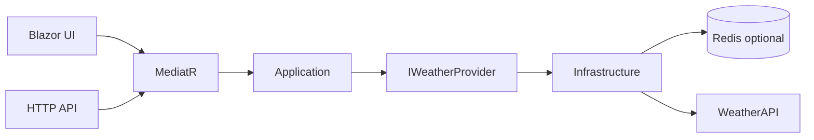

# Weather App

Production-grade Moscow weather dashboard built with .NET 10, Blazor Interactive Server, MediatR, Clean Architecture, WeatherAPI, HybridCache, Redis-ready Docker Compose, and CI quality gates.

## Demo / Overview

Screenshots are generated in the UI/E2E sprint. The first screen is the weather dashboard itself: current weather, remaining hours today, all hours tomorrow, and a three-day forecast.

## Features

- Fixed location: Moscow.
- Current weather from WeatherAPI.
- Hourly forecast: current provider-local hour through end of today, plus all 24 hours tomorrow.
- Three-day daily forecast via `forecast.json?days=3`.
- Loading skeleton, controlled error state, and retry.
- Blazor UI and HTTP API share one MediatR use case.
- Typed HttpClient, timeout/retry/circuit breaker, HybridCache, and Redis distributed cache in Docker Compose.
- Structured logging, health endpoints, OpenAPI, Docker, and GitHub Actions.

## Architecture



`Weather.Domain` has no dependencies. `Weather.Application` owns use cases and contracts. `Weather.Infrastructure` hides WeatherAPI, caching, resilience, and Redis. `Weather.Web` hosts Blazor and `/api/weather`.

## Technology Stack

- .NET SDK 10.0.400
- ASP.NET Core / Blazor Interactive Server
- MediatR 14
- Microsoft.Extensions.Http.Resilience
- Microsoft.Extensions.Caching.Hybrid
- Redis via `Microsoft.Extensions.Caching.StackExchangeRedis`
- xUnit v3, FluentAssertions, NetArchTest, bUnit, WireMock.Net, Playwright, BenchmarkDotNet

## Getting Started

```powershell
Set-Item Env:WeatherApi__Credential "<your WeatherAPI credential>"
dotnet run --project src/Weather.Web
start http://localhost:5000
```

## Configuration

| Key | Default | Notes |
|---|---:|---|
| `Weather:Location` | `Moscow` | Fixed city, not user-editable. |
| `Weather:ForecastDays` | `3` | WeatherAPI counts today as day one. |
| `WeatherApi:BaseUrl` | `https://api.weatherapi.com` | HTTPS only. |
| WeatherAPI credential | none | Supplied externally; not in repository. |
| `WeatherApi:UseSeparateCurrentEndpoint` | `true` | Calls current and forecast in parallel. |
| `ConnectionStrings:Redis` | none | Enables distributed HybridCache backend when set. |

The WeatherAPI credential is supplied from outside the repository. It is not committed and must not appear in source, fixtures, logs, screenshots, Docker layers, or CI output.

## Running Locally

```powershell
dotnet restore WeatherApp.slnx
dotnet build WeatherApp.slnx
dotnet run --project src/Weather.Web
```

## Running With Docker

```powershell
copy .env.example .env
# set WEATHERAPI_KEY in .env
docker compose up --build
```

The app is exposed at `http://localhost:8080`. Redis runs as a sidecar cache backend.

## Testing

```powershell
dotnet test WeatherApp.slnx
dotnet format WeatherApp.slnx --verify-no-changes
dotnet list WeatherApp.slnx package --vulnerable --include-transitive
```

See [docs/testing.md](docs/testing.md).

## Resilience

WeatherAPI calls use typed HttpClient with standard resilience. 401/403 and 429 are not useful retry candidates; transient/network and 5xx failures are handled by the standard pipeline. Cache key is versioned as `weather:moscow:v1`. Docker Compose enables Redis for a distributed HybridCache backend.

## Observability

Logs are structured and never include provider query strings. Health endpoints:

- `/health/live`
- `/health/ready`

OpenAPI document:

- `/openapi/v1.json`

See [docs/observability.md](docs/observability.md).

## Security

- HTTPS is used for WeatherAPI.
- Provider URLs with query strings are never logged.
- API errors return `ProblemDetails` without stack traces or credential details.
- CI checks vulnerable packages.

## Architecture Decisions

- [ADR-001: Clean Architecture And MediatR](docs/decisions/ADR-001-clean-architecture.md)
- [ADR-002: WeatherAPI Provider Contract](docs/decisions/ADR-002-weather-provider.md)
- [ADR-003: Blazor Interactive Server Rendering](docs/decisions/ADR-003-server-rendering.md)
- [ADR-004: Error Handling Model](docs/decisions/ADR-004-error-handling.md)
- [ADR-005: Caching And Resilience](docs/decisions/ADR-005-caching-resilience.md)

## Trade-offs

- No SQL database: weather state is external and transient; there is no persistence use case.
- No message broker: there is no asynchronous business workflow.
- Redis is optional: useful for Docker/multi-instance cache, but local development works without mandatory infrastructure.
- No microservices: the domain and deployment scale do not justify service decomposition.
- No authorization: the app is public and read-only.
- No FluentValidation: the query has no user-supplied parameters.

## Possible Next Steps

- Multi-city support.
- Provider failover.
- Background cache refresh.
- External OTLP backend.
- Full Playwright screenshots matrix.
- Measured NBomber load profile.
