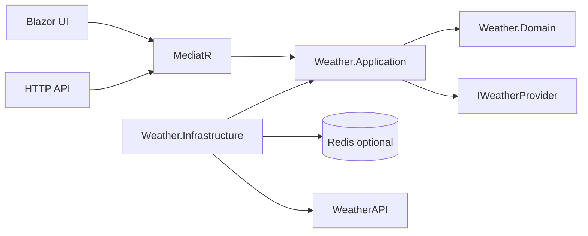

# Architecture

The application uses Clean Architecture with a vertical Application slice for the weather dashboard. Blazor UI and HTTP API both call the same MediatR query, so business orchestration is not duplicated.

Provider JSON contracts are internal to Infrastructure. Application models are provider-independent and tested without HTTP or JSON.
