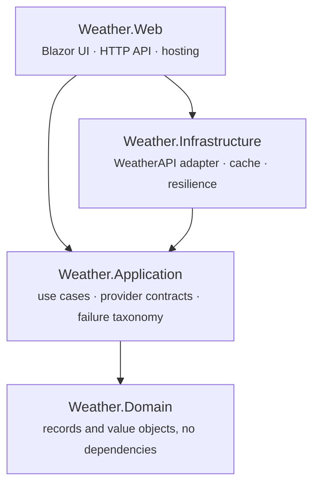
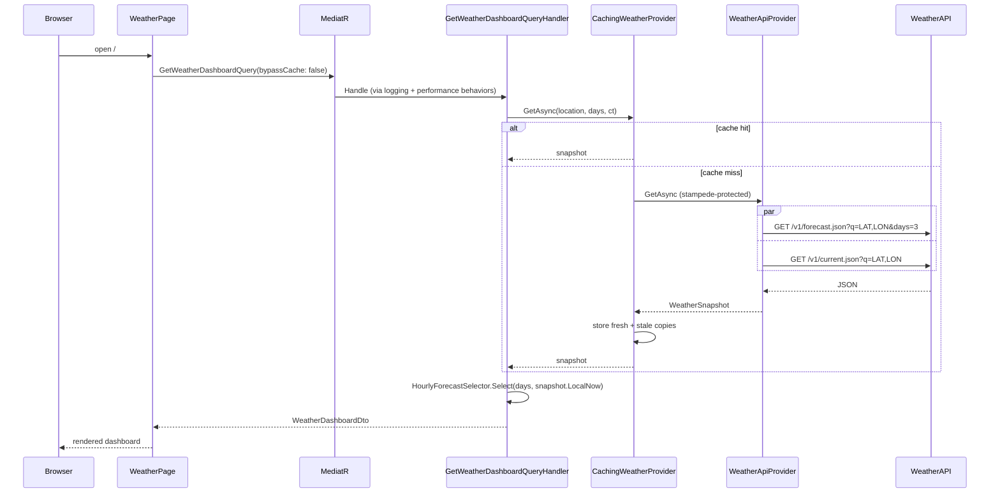

# Architecture

## Layers

`Infrastructure` depends on `Application` because it *implements* `Application`'s contracts. The arrow of
compile-time dependency and the arrow of runtime control point in opposite directions — that inversion is
the whole point of the layout.

Forbidden, and enforced by tests: `Domain →` anything, `Application → Infrastructure`,
`Application → Web`, `Infrastructure → Web`, `HttpClient` outside Infrastructure, provider DTOs outside
Infrastructure, system clock inside Domain or Application.

## Request flow

On failure the caching decorator looks for a recent good snapshot and returns it with `IsStale`, so a
provider outage degrades to old data rather than to an error screen.

## Where each concern lives

| Concern | Location | Why there |
|---|---|---|
| "Remaining hours today + all of tomorrow" | `HourlyForecastSelector` (Application) | Pure function, the highest-value thing to test in isolation |
| Choice of provider endpoints and query shape | `WeatherApiClient` (Infrastructure) | Provider detail; changing it must not touch the use case |
| Failure classification | `ProviderFailureMapper` (Infrastructure) → `WeatherFailureKind` (Application) | One place converts transport and Polly exceptions into the closed taxonomy |
| Caching and stampede protection | Decorators over the provider contracts (Infrastructure) | The handler stays free of caching concerns and remains trivially testable |
| Time | Provider's `location.localtime`, with `TimeProvider` as fallback | Server and container run in UTC; CI runs somewhere else again |
| Formatting and copy | `WeatherFormat`, `ConditionMood` (Web) | Presentation, not domain |
| HTTP status mapping | `WeatherExceptionHandler` (Web) | Transport representation of an application concept |

## Two use cases, one shape

The dashboard and the territory map are independent slices sharing the same structure: a MediatR query, a
handler that reads configuration and calls a provider contract, an adapter behind that contract, and a
caching decorator over the adapter. Adding the map required no change to the dashboard and no new
architectural concept — which is the practical test of whether the layering was worth having.

The map is loaded separately from the dashboard on purpose. It costs one provider call per point, so its
failure mode has to be independent: the map degrades to an inline notice while the main screen keeps
working.

## Abstractions, and the ones not created

Only two abstractions exist over the provider: `IWeatherProvider` and `IRegionalWeatherProvider`. They are
separate rather than one interface with two methods so the dashboard use case does not depend on the map
feature.

Deliberately absent: `IWeatherService`, `WeatherManager`, `WeatherFacade`, a repository over an HTTP call,
and a generic `Result<T>`. Each would add a name without adding a boundary.
