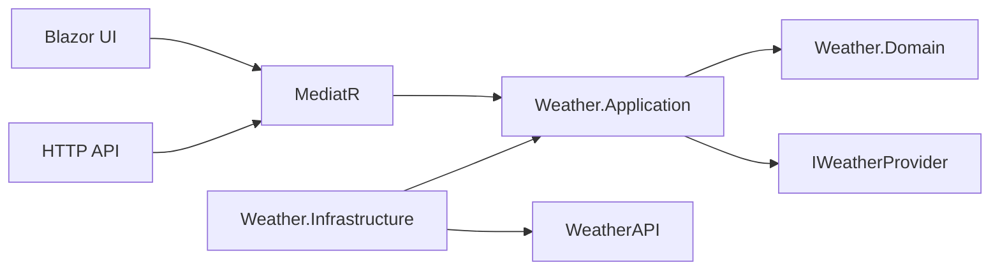

# Weather App Requirements

## Functional Requirements

| Requirement | Acceptance criteria |
|---|---|
| Fixed location | The application always requests weather for Moscow. The user cannot change the location through the UI. |
| Current weather | The dashboard shows current temperature, feels-like temperature, humidity, wind, pressure, UV index, condition text, condition icon, and observation time. |
| Remaining hours today | The hourly section includes the current local hour and all later hours of the provider-local current day. Earlier hours are excluded. |
| Complete tomorrow | The hourly section includes all 24 provider-local hours of tomorrow when the provider returns them. |
| Three-day daily forecast | The daily section shows exactly the three daily forecast blocks returned by `forecast.json?days=3`. |
| Loading state | Initial load and retry display a skeleton that follows the final dashboard layout. |
| Error state | Provider/configuration failures render a human-readable message without stack traces, provider URLs, or credential details. |
| Retry | Retry triggers a new MediatR request, disables the button while pending, and prevents duplicate concurrent UI requests. |
| Territory map (beyond the assignment) | An open-source map shows current conditions across configured points, with an optional precipitation radar overlay. It loads independently, so its failure never takes the dashboard down. |

## Non-Functional Requirements

- Deterministic tests: no test depends on machine clock, machine timezone, network, or a live WeatherAPI response.
- Provider resilience: timeout, bounded retry, circuit breaker, cache, and stampede protection protect both user experience and provider quota.
- Secure configuration: API key is supplied externally through local protected configuration, environment variables, container configuration, or CI protected variables.
- No committed credentials: the repository must not contain the WeatherAPI key in source, config, fixtures, screenshots, logs, or history.
- Maintainability: Clean Architecture boundaries are enforced by architecture tests.
- Accessibility: semantic buttons, keyboard navigation, visible focus, AA contrast target, and `aria-live` state announcements.
- Responsive UI: the dashboard is usable at 375, 768, 1280, and 1600 pixel widths.
- Reproducible build: SDK is pinned through `global.json`, packages are centrally versioned, and warnings fail the build.
- Operational diagnostics: structured logging, health checks, and a path to OpenTelemetry metrics/tracing.

## Ambiguities And Resolutions

| Ambiguity | Resolution |
|---|---|
| Does "remaining hours today" include the current hour? | Yes. If provider-local time is 10:30, the first hourly card is 10:00. |
| What is the source of "now"? | Provider-local time from WeatherAPI `location.localtime`, `location.localtime_epoch`, and `location.tz_id`. Server time is not authoritative. `TimeProvider` is used for cache timestamps and as an explicit fallback. |
| How is the location addressed in the provider query? | As `q=LAT,LON` (`55.7522,37.6156`), which is the form the assignment shows. Coordinates also avoid cross-provider ambiguity of city names and are what the territory map needs. |
| How many forecast days are requested? | `days=3`. WeatherAPI treats today as day one, so this covers today, tomorrow, and the day after tomorrow. |
| Is `current.json` necessary? | `forecast.json` includes `current`, but the assignment names both endpoints. The adapter supports both and calls them in parallel when `WeatherApi:UseSeparateCurrentEndpoint=true`. |
| Should the app use the `http://` endpoint from the email? | No. WeatherAPI supports HTTPS, and the key is sent in the query string. The application uses `https://api.weatherapi.com`. |
| Should readiness call WeatherAPI? | No. Readiness validates local configuration/cache availability only; periodic health probes must not burn provider quota or depend on provider uptime. |
| Should SQL, Redis, queues, or Hangfire be added? | Not for the required scope. There is no persistence use case, async business workflow, or distributed deployment requirement. These are documented as extension paths. |

## Test-Enforced Invariants

| Invariant | Test level |
|---|---|
| Hourly count equals `(24 - localNow.Hour) + 24` for complete today/tomorrow input. | Application unit |
| The current provider-local hour is included. | Application unit |
| Third-day hourly entries are excluded from the hourly strip. | Application unit |
| Hour selection compares provider-local wall-clock values, not UTC instants. | Application unit |
| Application does not reference Infrastructure or Web. | Architecture |
| Provider DTOs remain internal to Infrastructure. | Architecture |
| Domain/Application contain no `DateTime.Now`, `DateTime.UtcNow`, or `DateTimeOffset.Now`. | Architecture |
| WeatherAPI key is never logged. | Infrastructure contract |
| Blazor prerender/circuit activation causes at most one provider request. | Component/integration |
| Health checks do not call WeatherAPI. | Integration |

## Dependency Diagram

